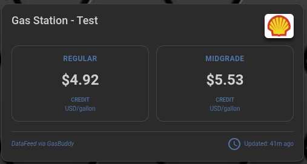
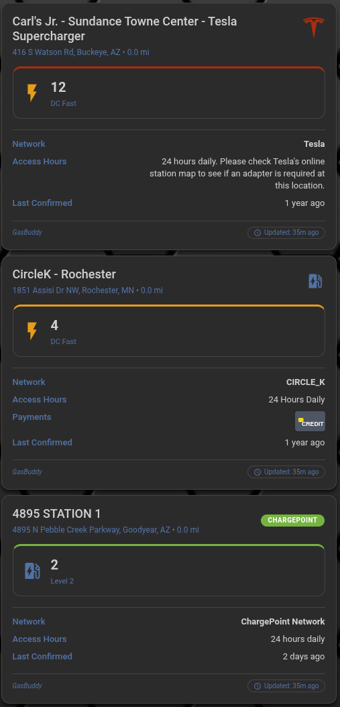
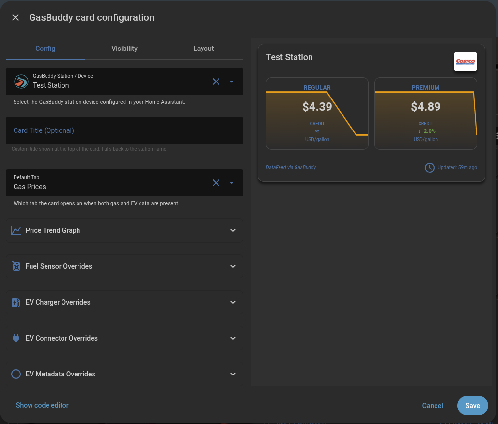

# GasBuddy Card

[](https://github.com/firstof9/gasbuddy-card/releases)
[](https://github.com/firstof9/gasbuddy-card/releases)
[](https://github.com/firstof9/gasbuddy-card/actions/workflows/lint.yml)
[](https://github.com/hacs/integration)
[](https://github.com/firstof9/gasbuddy-card/blob/main/LICENSE)

A modern, premium Home Assistant custom Lovelace card for displaying gas prices and EV charging station data fetched from the [GasBuddy custom integration](https://github.com/firstof9/ha-gasbuddy).

## Features

- **Fuel Prices & EV Chargers:** Displays comprehensive gas station fuel prices and a dedicated EV view showing available chargers and connector types.
- **Price Trend Graph:** Optional background sparkline behind each fuel grade, sourced from Home Assistant's recorder history so you can see whether prices are trending up or down.
- **Station Address:** Automatically discovers and displays the station address and coordinates.
- **EV Payment Options:** Shows accepted payment methods for EV charging using recognizable credit and debit card logos.
- **Last Confirmed Status:** Clearly shows the time elapsed since the last price or charger status confirmation.
- **Version Tracking:** Outputs the active card version into your browser's console for easy debugging.
- **Visual Editor:** Full UI configuration through the Lovelace card editor.

## Screenshots

### Gas Prices View


### EV Chargers View


### Visual Configuration


## Requirements

This card requires the **[GasBuddy custom integration](https://github.com/firstof9/ha-gasbuddy)** to be installed and configured in Home Assistant.

## Installation

### HACS (Recommended)

[](https://my.home-assistant.io/redirect/hacs_repository/?owner=firstof9&repository=gasbuddy-card&category=plugin)

1. Open HACS.
2. Click on "Frontend".
3. Click on the three dots in the top right corner and select "Custom repositories".
4. Add `https://github.com/firstof9/gasbuddy-card` with category "Lovelace".
5. Search for "GasBuddy Card" and click "Download".

### Manual

1. Download `gasbuddy-card.js` from the latest release (it's a single self-contained bundle).
2. Copy it to your `config/www/` directory.
3. Add the following to your `configuration.yaml` or through the UI:
   ```yaml
   resources:
     - url: /local/gasbuddy-card.js
       type: module
   ```

## Usage

The card uses your GasBuddy device ID (from the integration device registry) to automatically discover and display the station name, coordinates, fuel prices, and EV charger states.

```yaml
type: custom:gasbuddy-card
device_id: 32_character_device_registry_id_from_hacs_gasbuddy
default_mode: gas             # Optional: 'gas' or 'ev' (defaults to 'gas')
title: "My Local Station"     # Optional: Custom card title override
show_trend: true              # Optional: render a background price-history sparkline behind each fuel grade (defaults to false)
trend_hours: 168              # Optional: how many hours of history to plot (defaults to 168 = 7 days; clamped 1-720)
```

### Price trend graph

When `show_trend: true` the card fetches recent state history for each
visible fuel-grade sensor and renders a thin sparkline as the background
of each price tile. The default window is **7 days (168 hours)**; the
visual editor exposes a number field that accepts 1–720 hours (30 days).

Notes:

- History is fetched at most once every 10 minutes per card instance, so
  enabling it does not put meaningful load on the recorder.
- The sparkline uses Home Assistant's accent color and stays purely
  decorative — current price text always renders on top.
- If a sensor has fewer than two recorded values in the requested window
  (e.g. it was just added), the card simply omits its sparkline.
- Requires the Home Assistant `recorder` integration to be enabled for
  the configured GasBuddy sensors. (`recorder` is on by default in HA.)

## Advanced configuration

If you need to override individual sensors discovered automatically by the device ID, you can supply their entity IDs explicitly. The card supports a wide variety of specific sensor overrides.

### Supported Overrides

#### Fuel Price Entities
You can override any of these by appending `_entity` (e.g., `regular_gas_entity`):
- `regular_gas`, `midgrade_gas`, `premium_gas`, `diesel`
- `regular_gas_cash`, `midgrade_gas_cash`, `premium_gas_cash`, `diesel_cash`
- `e85`, `e85_cash`, `e15`, `e15_cash`
- `last_updated`

#### EV Sensor Entities
You can override any of these by appending `_entity` (e.g., `ev_dc_fast_entity`):
- **Chargers:** `ev_level1`, `ev_level2`, `ev_dc_fast`
- **Connectors:** `ev_j1772`, `ev_j1772_power`, `ev_ccs`, `ev_ccs_power`, `ev_chademo`, `ev_chademo_power`, `ev_nacs`, `ev_nacs_power`
- **Metadata:** `ev_network`, `ev_pricing`, `ev_access_hours`, `ev_status`, `ev_cards_accepted`, `ev_date_last_confirmed`

```yaml
type: custom:gasbuddy-card
device_id: 32_character_device_registry_id
regular_gas_entity: sensor.other_regular_gas_sensor
ev_dc_fast_entity: sensor.other_ev_dc_fast_chargers
ev_cards_accepted_entity: sensor.other_ev_payment_methods
```

### Full Configuration Options

| Option | Type | Default | Description |
|---|---|---|---|
| `type` | string | **Required** | Must be `custom:gasbuddy-card`. |
| `device_id` | string | **Required** | The device registry ID of the GasBuddy station. |
| `title` | string | Optional | Custom title header of the card. |
| `default_mode` | `"gas"` \| `"ev"` | `"gas"` | Which tab the card opens on when both gas and EV data are present. |
| `show_trend` | boolean | `false` | Render a background price-history sparkline behind each fuel grade. |
| `trend_hours` | number | `168` | Hours of history to plot when `show_trend` is on. Range 1–720. |
| `<fuel_type>_entity` | string | Auto-discovered | Manual override for specific fuel price sensors. |
| `<ev_sensor>_entity` | string | Auto-discovered | Manual override for specific EV charger status/connector sensors. |

## Development

The card is written in TypeScript with [Lit](https://lit.dev) and bundled with [Rollup](https://rollupjs.org). Source lives in `src/`; the committed `gasbuddy-card.js` at the repo root is the bundled output.

```bash
npm install        # install dev deps + lit
npm run typecheck  # tsc --noEmit (no JS emit, just type checking)
npm test           # run placeholder test script
npm run build      # produce gasbuddy-card.js from src/
npm run build:watch  # rebuild on every save while iterating
```

CI runs `typecheck`, `build`, and `test` on every PR. The `build` job also fails CI if the committed bundle is out of sync with source.
